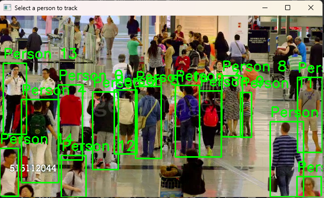
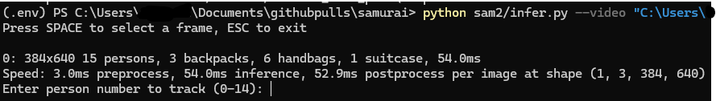

<div align="center">


# SAMURAI: Adapting Segment Anything Model for Zero-Shot Visual Tracking with Motion-Aware Memory

[Cheng-Yen Yang](https://yangchris11.github.io), [Hsiang-Wei Huang](https://hsiangwei0903.github.io/), [Wenhao Chai](https://rese1f.github.io/), [Zhongyu Jiang](https://zhyjiang.github.io/#/), [Jenq-Neng Hwang](https://people.ece.uw.edu/hwang/)

University of Washington
</div>

[[Arxiv]](https://arxiv.org/abs/2411.11922) [[Project Page]](https://yangchris11.github.io/samurai/) [[Raw Results]](https://drive.google.com/drive/folders/1ssiDmsC7mw5AiItYQG4poiR1JgRq305y?usp=sharing) 

This repository is a **fork of** the official implementation of SAMURAI: Adapting Segment Anything Model for Zero-Shot Visual Tracking with Motion-Aware Memory

## Getting Started

Code tested on `Cuda 12.1` with `Python 3.10.11` on `Windows`

```
> nvcc --version
nvcc: NVIDIA (R) Cuda compiler driver
Copyright (c) 2005-2023 NVIDIA Corporation
Built on Wed_Feb__8_05:53:42_Coordinated_Universal_Time_2023
Cuda compilation tools, release 12.1, V12.1.66
Build cuda_12.1.r12.1/compiler.32415258_0
```
---

#### SAMURAI Installation 

SAM 2 needs to be installed first before use. The code requires `python>=3.10`, as well as `torch>=2.3.1` and `torchvision>=0.18.1`. Please follow the instructions [here](https://github.com/facebookresearch/sam2?tab=readme-ov-file) to install both PyTorch and TorchVision dependencies. You can install **the SAMURAI version** of SAM 2 on a GPU machine using:
```
> cd sam2
> pip install -e .
> pip install -e ".[notebooks]"
```

Please see [INSTALL.md](https://github.com/facebookresearch/sam2/blob/main/INSTALL.md) from the original SAM 2 repository for FAQs on potential issues and solutions.

Install dependencies and ultralytics (for prompt)

```
> pip install matplotlib tikzplotlib jpeg4py opencv-python lmdb pandas scipy loguru
> pip install torch torchvision --index-url https://download.pytorch.org/whl/cu121 --upgrade
> pip install ultralytics 
```

#### SAM 2.1 Checkpoint Download 

```
> cd checkpoints
> ./download_ckpts.sh
> cd ..
```

Run the same with `git bash` if it opens .sh file in vscode for you


#### Main Inference
```
> python sam2/infer.py --video "path-to-video"
```


For example,
```
> python sam2/infer.py --video "C://Users//johndoe//samurai//myvideo.mp4"
```

### Running the Video with Frame Selection

*   Run the `infer.py` file using Python, passing the video file as an argument: `python infer.py --video <video_file>`
*   The program will start playing the video to select a frame containing a person by pressing the **SPACE** key.
*   Once a frame is selected, the program will wait for user input in the terminal window.



### Entering Person ID

*   Enter the ID of one of the detected people in the terminal window when prompted.
*   The entered ID should match one of the IDs assigned to the detected persons by the YOLO11x model.



### Loading and Displaying Model Outputs
-----------------------------------------

*   After entering the correct ID, the program will load the YOLO11x model and SAM2 side-by-side and show the results


## Acknowledgment

SAMURAI is built on top of [SAM 2](https://github.com/facebookresearch/sam2?tab=readme-ov-file) by Meta FAIR.

The VOT evaluation code is modifed from [VOT Toolkit](https://github.com/votchallenge/toolkit) by Luka Čehovin Zajc.

## Citation

Please consider citing our paper and the wonderful `SAM 2` if you found our work interesting and useful.
```
@article{ravi2024sam2,
  title={SAM 2: Segment Anything in Images and Videos},
  author={Ravi, Nikhila and Gabeur, Valentin and Hu, Yuan-Ting and Hu, Ronghang and Ryali, Chaitanya and Ma, Tengyu and Khedr, Haitham and R{\"a}dle, Roman and Rolland, Chloe and Gustafson, Laura and Mintun, Eric and Pan, Junting and Alwala, Kalyan Vasudev and Carion, Nicolas and Wu, Chao-Yuan and Girshick, Ross and Doll{\'a}r, Piotr and Feichtenhofer, Christoph},
  journal={arXiv preprint arXiv:2408.00714},
  url={https://arxiv.org/abs/2408.00714},
  year={2024}
}

@misc{yang2024samurai,
      title={SAMURAI: Adapting Segment Anything Model for Zero-Shot Visual Tracking with Motion-Aware Memory}, 
      author={Cheng-Yen Yang and Hsiang-Wei Huang and Wenhao Chai and Zhongyu Jiang and Jenq-Neng Hwang},
      year={2024},
      eprint={2411.11922},
      archivePrefix={arXiv},
      primaryClass={cs.CV},
      url={https://arxiv.org/abs/2411.11922}, 
}
```
